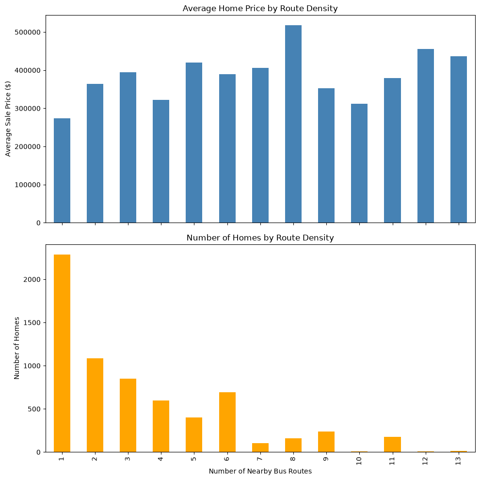

# Bus Route Density vs. Home Sale Price — Fredericksburg, VA

## Question
Does proximity to public transit (bus routes) affect single-family home sale prices in Fredericksburg, VA?

## Method
- Merged parcel and sales data from the City of Fredericksburg's ArcGIS open data portal
- Filtered to the most recent valid sale per property, removed $0 and outlier transactions ($10K–$2M range), and kept only single-family homes
- Created a quarter-mile (1,320 ft) buffer around each home and used a spatial join to count how many bus routes intersected that buffer ("route density")
- Calculated the correlation between route density and sale price

## Key Finding
A weak positive correlation (**r ≈ 0.17**) between transit route density and home sale price across 6,600+ single-family homes. The relationship is modest — most of the variation in home prices comes from other factors — but the direction is consistent, and the finding held up after two rounds of scrutiny (outlier removal and filtering out non-residential properties, which initially masked and then confirmed the effect).

## Tools
Python, pandas, GeoPandas, Matplotlib, JupyterLab

## Data Sources
- [City of Fredericksburg GIS Open Data Portal](https://data-fredericksburg.opendata.arcgis.com/search?q=Parcels&type=Shapefile)
